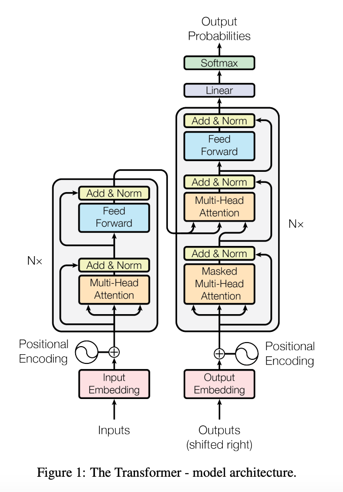
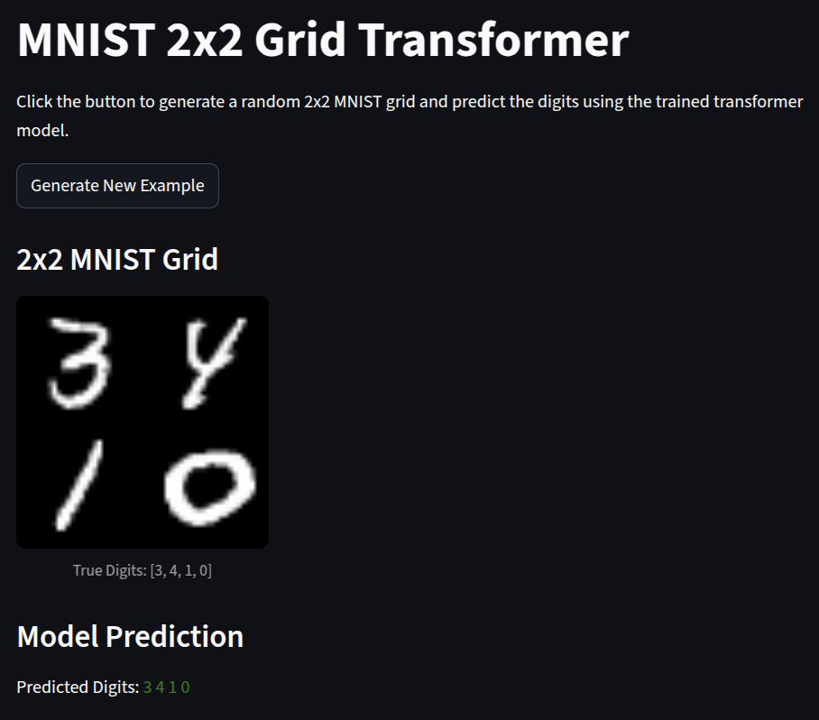

# Encoder‒Decoder Transformer (MNIST Grids)

<div style="display: flex; align-items: flex-start; gap: 20px;">

  <div style="flex: 1;">
    <p>
      This repository contains my <strong>week 3 project</strong> for the
      <a href="https://ml.institute/learn">Machine Learning Institute</a> six-week bootcamp.
      The challenge was to implement the full <em>Attention Is All You Need</em> architecture from scratch,
      then apply it to a fun toy task: <strong>encode multi-digit 2 &times; 2 MNIST grids and decode their sequence left-to-right</strong>.
      We followed the paper’s well‑known figure and multiple blog posts (using little to no AI tooling!)
      to hand‑code multi‑head attention, positional encodings, masking, and the encoder &amp; decoder stacks.
      It pushed us to our coding limits but came out successful! 🎉
    </p>
  </div>

  <div style="flex: 1;">
    
  </div>

</div>

---

## 📦 Setup

> Tested on Ubuntu 24.04 + Python 3.10 + CUDA 12. Replace paths if you prefer a different install location.

1. **Install Miniconda + Mamba (1-liner):**
   ```bash
   curl -sS https://repo.anaconda.com/miniconda/Miniconda3-latest-Linux-x86_64.sh -o miniconda.sh \
     && bash miniconda.sh -b -p "$HOME/miniconda" \
     && eval "$(~/miniconda/bin/conda shell.bash hook)" \
     && conda install -y -n base -c conda-forge mamba
   ```
2. **Create & activate the env:**
   ```bash
   mamba env create -f env.yml
   mamba activate enc_dec_env   # env name from env.yml
   ```
3. **Get the data (MNIST) & pickle it:**
   ```bash
   python misc/download_data.py
   ```
4. *(Optional)* **Verify CUDA is visible:**
   ```bash
   python misc/gpu_test.py
   ```

---

## 🚀 Quick Demo

1. **Follow the set up instructions above**
2. **Download our trained model checkpoint** (<3 MB):  
   [Google Drive link](https://drive.google.com/file/d/1hT5eCMmYlrDz0ZKNsQwgbBgDyISyv4LH/view?usp=sharing)

   Save it as:
   ```text
   checkpoints/enc_and_dec/final_model.pth
   ```

2. **Launch the Streamlit front-end:**
   ```bash
   streamlit run model/frontend.py
   ```

   <p align="center">
     
   </p>

   The app previews unseen 2 × 2 MNIST grids from the held-out test set, then shows the model’s predicted digit sequence.

---

## 📋 Dataset Info

| Split | Images | Notes |
|-------|--------|-------|
| **train** | 50 000 | Standard MNIST digits (single 28 × 28) |
| **val**   | 10 000 | Held-out MNIST digits for hyperparameter selection|
| **test** | 10 000 | Test dataset held out for the demo|
| **grid**  | Randomly generared | Each sample is a 56 × 56 image made by tiling 4 random digits taken from the respective dataset; target = 4-digit sequence |

The helper `model/image_grid_dl.py` builds the grid dataset on-the-fly and yields `(grid_img, target_seq)` pairs.

---

## 🔡 Patch & Positional Encoding

* **`patch_and_embed.py`** slices 56 × 56 grids into *16 patches* (14 × 14 each) → flattens & projects to *D = 128*.
* A learnable `[CLS]` vector is prepended so the encoder can output a single grid embedding.
* Trainable positional embeddings are added to both encoder patch tokens and decoder input tokens.

---

## 🧠 Model Overview (high-level)

| Component | File | Purpose |
|-----------|------|---------|
| **EncoderOnly** | `model/encoder_only.py` | Baseline MNIST classifier (98 % val acc) |
| **Encoder** | `model/encoder.py` | 6 layers, 8-head MH-Attention, FFN, residual + LN |
| **Decoder** | `model/decoder.py` | 6 layers with causal mask, cross-attention to encoder out |
| **Transformer** | `model/transformer.py` | Wraps encoder + decoder → predicts sequence logits |

> Loss = sum of cross-entropy over sequence positions.

---

## 🏋️ Training

### 1. Encoder-only classifier
We trained a simple single digit classifier as a first step
```bash
python model/train_enc.py
```
*Logs to WandB; hits ~98 % val accuracy after 3 epochs on RTX 4060-8 GB.*

### 2. Full Encoder-Decoder
```bash
python model/train_enc_dec.py
```
*Uses `model/image_grid_dl.py` (2 × 2 grids).  
Checkpoints saved to `checkpoints/enc_and_dec/`.  
Best val seq-accuracy ≈ 93 % in 15 epochs.*

---

## 🌐 Inference Pipeline

```python
from model.transformer import Transformer
from PIL import Image
import torch

model = Transformer.load_from_checkpoint(
    "checkpoints/enc_and_dec/final_model.pth",
    map_location="cpu"
)
model.eval()

grid = Image.open("some_grid.png")  # 56×56 PNG of 4 digits
pred = model.predict(grid)
print("Predicted seq:", pred)  # e.g. [3, 7, 1, 8]
```

---

## 📝 Useful Notebooks / Scripts

| Path | Description |
|------|-------------|
| `misc/download_data.py` | Downloads MNIST + pickles train/val splits |
| `misc/gpu_test.py` | Tiny CUDA sanity check |

---

## 📚 Citation
> Vaswani *et al.* 2017. **Attention Is All You Need**.

---

## 🗂 Directory Structure (trimmed)

```
.
├── checkpoints/                # Saved models (git-ignored)
│   └── enc_and_dec/
│       └── final_model.pth
├── data/                       # MNIST raw & pickles (git-ignored)
│   ├── raw/                    # pickle locations
│   └── MNIST/
├── env.yml                     # Conda/Mamba environment
├── misc/
│   ├── download_data.py
│   ├── figure.png              # Transformer architecture figure
│   ├── frontend.png            # Streamlit screenshot
│   └── gpu_test.py
├── model/
│   ├── encoder_only.py
│   ├── encoder.py
│   ├── decoder.py
│   ├── transformer.py
│   ├── patch_and_embed.py
│   ├── image_grid_dl.py
│   ├── train_enc.py
│   └── train_enc_dec.py
└── README.md                   # You are here
```
